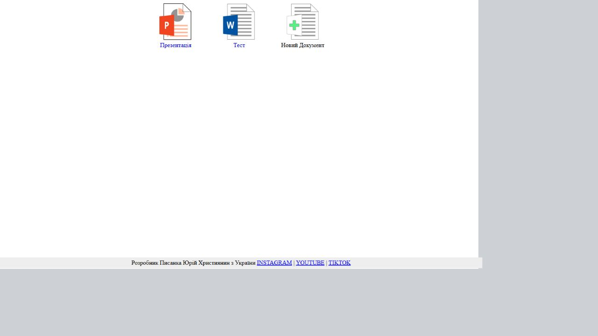
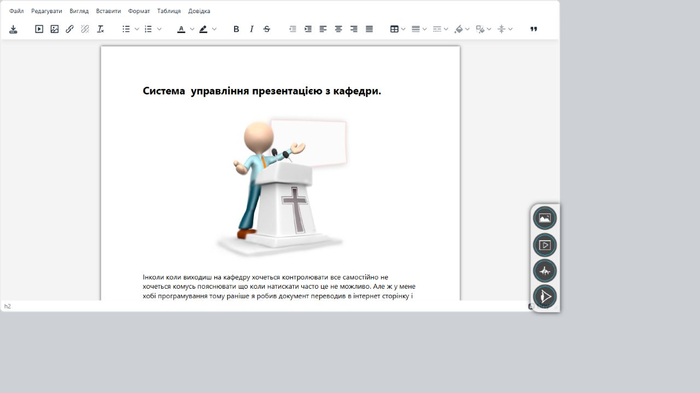
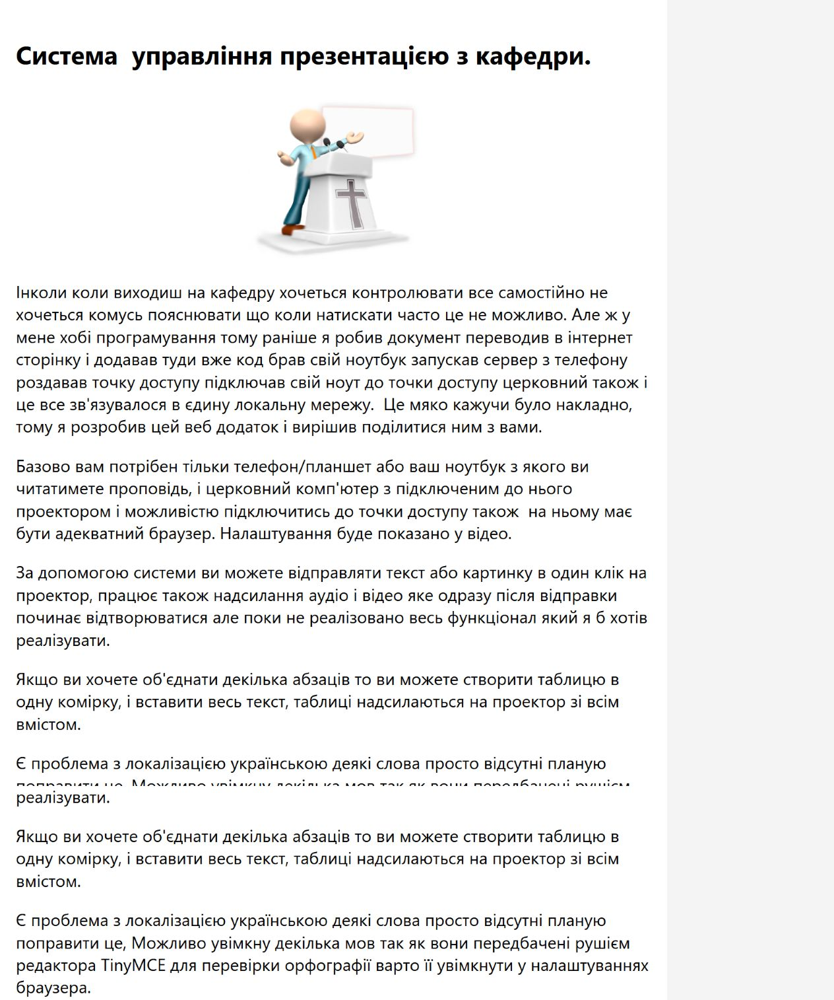
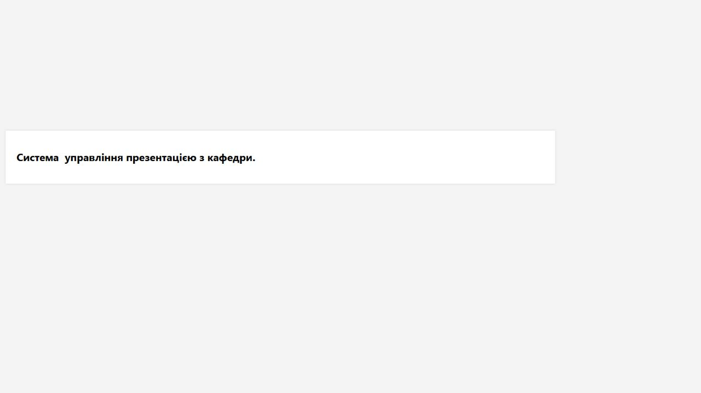

# Present

**Українською** | [English](#english)

Present — це локальна веб-система для керування матеріалами під час проповіді, доповіді, уроку або будь-якого виступу. Ідея проста: ви читаєте підготовлений документ з ноутбука, планшета чи телефона, клікаєте потрібний абзац, зображення, аудіо або відео, і цей фрагмент одразу з'являється на окремій веб-сторінці проектора.

Проект працює в локальній мережі: один комп'ютер запускає сервер, інші пристрої відкривають сторінки керування, читання або показу. Інтернет для самої презентації не потрібен.

## Скріншоти

### Список проектів



### Редактор документа



### Режим читання



### Екран проектора



## Для чого це

Present створений для ситуацій, коли ведучий хоче самостійно контролювати, що саме і коли з'являється на проекторі. Це може бути:

- проповідь або богослужіння;
- лекція чи навчання;
- доповідь;
- репетиція або виступ;
- показ тексту, зображень, аудіо та відео без окремого оператора.

## Як це працює

1. Відкрийте головну сторінку і створіть або виберіть проект.
2. У вбудованому редакторі TinyMCE підготуйте текст документа.
3. Додайте зображення, аудіо або відео у відповідні медіа-панелі.
4. Відкрийте сторінку проектора `present.php` на комп'ютері, підключеному до проектора.
5. Відкрийте сторінку читання `view.php` на пристрої, з якого будете вести виступ.
6. Клікайте абзаци, таблиці, картинки, аудіо або відео — вибраний блок одразу відобразиться на проекторі.

## Можливості

- локальний сервер без потреби в інтернеті;
- вбудований редактор документа;
- збереження тексту проекту в SQLite;
- підтримка зображень, аудіо та відео;
- окрема сторінка для читання;
- окрема сторінка для проектора;
- оновлення проектора без ручного перезавантаження сторінки;
- робота з телефону, планшета або комп'ютера в одній локальній мережі;
- базова авторизація.

## Запуск

Репозиторій містить портативний PHP 7.3 для Windows.

1. Завантажте або склонуйте репозиторій.
2. Запустіть файл:

```bat
run – PHP_7.3 – 64 127.0.0.1.bat
```

3. Відкрийте в браузері:

```text
http://127.0.0.1:8000/
```

4. Увійдіть:

```text
login: admin
password: admin
```

Щоб відкрити систему з телефона або іншого комп'ютера в тій самій мережі, використайте IP-адресу комп'ютера, на якому запущений сервер:

```text
http://192.168.x.x:8000/
```

## Сторінки

- `/` — список проектів.
- `/editor.php?project=НазваПроекту` — редактор документа.
- `/view.php?project=НазваПроекту` — режим читання і керування показом.
- `/present.php` — екран проектора.

## Структура проекту

```text
home/
  AppData/           службові файли, іконки, тимчасові дані
  include/           PHP, CSS і JavaScript
  project/           документи і медіа проектів
  editor.php         редактор документа
  view.php           режим читання
  present.php        екран проектора
  sendmediaim.php    завантаження медіа
Modules/
  PHP/               портативний PHP runtime
```

## Поточний стан

Проект уже придатний для базового використання: можна створювати документи, редагувати текст, додавати медіа і показувати вибрані блоки на сторінці проектора.

Є речі, які ще варто доробити:

- зручне видалення проектів з інтерфейсу;
- керування користувачами;
- перегляд попередніх версій документа;
- сучасніший інтерфейс;
- покращена підтримка різних мов;
- інструкція у відеоформаті.

## English

[Українською](#present) | **English**

<details open>
<summary>English description</summary>

Present is a local web application for controlling presentation material during a sermon, talk, lesson, or live speech. The core idea is straightforward: you read a prepared document from a laptop, tablet, or phone, click a paragraph, image, audio, or video block, and that block immediately appears on a separate projector page.

The app is designed for a local network. One computer runs the server, while other devices open the editor, reading view, or projector screen. The presentation itself does not require an internet connection.

### Screenshots

#### Projects


#### Document Editor


#### Reading Mode


#### Projector Screen


### Use Cases

- sermons and church services;
- lectures and classes;
- public talks;
- rehearsals and live events;
- sending text, images, audio, and video to a projector without a dedicated operator.

### How It Works

1. Open the main page and create or select a project.
2. Prepare the document in the built-in TinyMCE editor.
3. Add images, audio, or video through the media panels.
4. Open `present.php` on the computer connected to the projector.
5. Open `view.php` on the device used by the speaker.
6. Click paragraphs, tables, images, audio, or video blocks — the selected content appears on the projector immediately.

### Features

- local server, no internet required for presentation playback;
- built-in document editor;
- SQLite-based document storage;
- image, audio, and video support;
- dedicated reading page;
- dedicated projector page;
- automatic projector updates;
- works from phones, tablets, and computers on the same local network;
- basic authentication.

### Running

The repository includes a portable PHP 7.3 runtime for Windows.

1. Download or clone the repository.
2. Run:

```bat
run – PHP_7.3 – 64 127.0.0.1.bat
```

3. Open:

```text
http://127.0.0.1:8000/
```

4. Sign in:

```text
login: admin
password: admin
```

To use the app from a phone or another computer on the same network, open the server computer's local IP address:

```text
http://192.168.x.x:8000/
```

### Pages

- `/` — project list.
- `/editor.php?project=ProjectName` — document editor.
- `/view.php?project=ProjectName` — reading and control view.
- `/present.php` — projector screen.

### Project Status

Present is usable for the main workflow today: creating documents, editing text, adding media, and sending selected blocks to the projector page.

Planned improvements include project deletion from the UI, user management, document version history, a more modern interface, better multilingual support, and a video guide.

</details>
